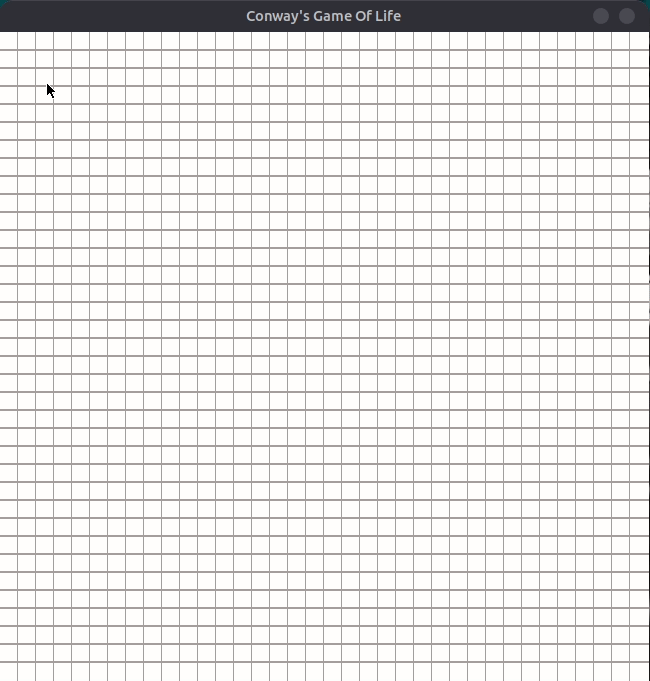

# Conway's Game Of Life

## Introduction
This is a visualization of Conway's game of life made using python and pygame 

## Contents
* [Demo](https://github.com/Crucizer/Conways-game-of-life/#Demo)
* [Installation](https://github.com/Crucizer/Conways-game-of-life/#Installation)
* [Usuage](https://github.com/Crucizer/Conways-game-of-life/#Usuage)
* [Explanation](https://github.com/Crucizer/Conways-game-of-life/#Explanation)

## Demo

### Glider in Conway's Game of Life

### The F-pentomino

## Installation
* Install 3.8 from [here](https://www.python.org/downloads/release/python-382/)
* Install git from [here](https://git-scm.com/downloads)
* Run `git clone https://github.com/Crucizer/Conways-game-of-life.git`
* Run `pip install -r requirements.txt`

## Usage
* Execute `main.py`
* Draw a pattern on the grid(Using mouse left key). You can remove a cell by right clicking on it.
* Press `space` to solve this grid step by step.
* Press `s` to solve keep solving it automatically.
* Press `c` to stop and to draw again.
* Press `r` to reset.

## Explanation

The universe of the Game of Life is an infinite, two-dimensional orthogonal grid of square cells, each of which is in one of two possible states, live or dead, (or populated and unpopulated, respectively). Every cell interacts with its eight neighbours, which are the cells that are horizontally, vertically, or diagonally adjacent. At each step in time, the following transitions occur:

### Rules
* Any live cell with fewer than two live neighbours dies, as if by underpopulation.
* Any live cell with two or three live neighbours lives on to the next generation.
* Any live cell with more than three live neighbours dies, as if by overpopulation.
* Any dead cell with exactly three live neighbours becomes a live cell, as if by reproduction.

Read more about Conway's Game Of Life [here](https://en.wikipedia.org/wiki/Conway%27s_Game_of_Life)